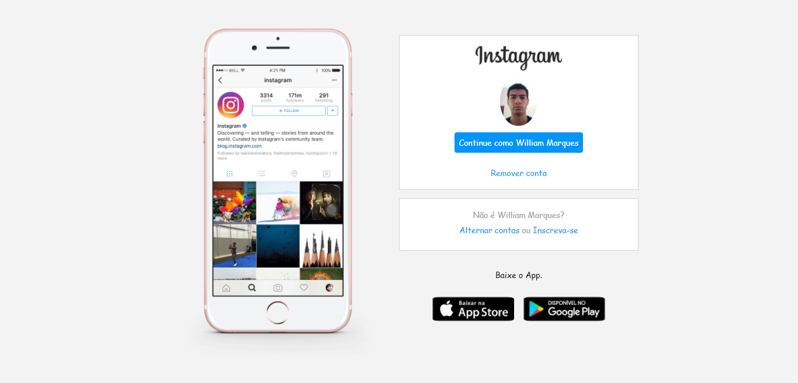
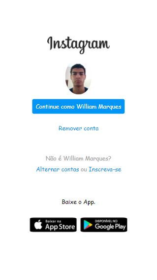

## Recriando a página de login do Instagram ​ :memo::coffee:

Este projeto tem como finalidade reconstruir a página inicial de login do Instagram, utilizando apenas **HTML5** e **CSS3**. Onde também foi aplicado o conceito de modelo de layout **Flexbox**, uma metodologia de posicionamento de elementos assim como os conceitos de responsividade.

### Demonstração  :video_camera:

|                    Desktop                    |
| :-------------------------------------------: |
|  |
|                  **Tablet**                   |
|   |
|                  **Mobile**                   |
|   |

### Começando  :gear:

Para reproduzir o projeto localmente na usa máquina você vai precisar seguir alguns passos :point_down:

- Clone o repositório através do Git : ``git clone https://github.com/WillJR183/frontend-projects.git``
- Acesse a pasta do projeto:  ``instagram-login-page``
- Abra o arquivo ``index.html`` através de um navegador
- Para editar os arquivos você vai precisar de um editor de texto, como por exemplo: VS Code , Notepad++ , Sublime Text ou se preferir a maneira hardcore :heavy_exclamation_mark: , use o editor de texto nativo do seu sistema  operacional.

### Tecnologias ​ :mag:

- HTML5
- CSS3
